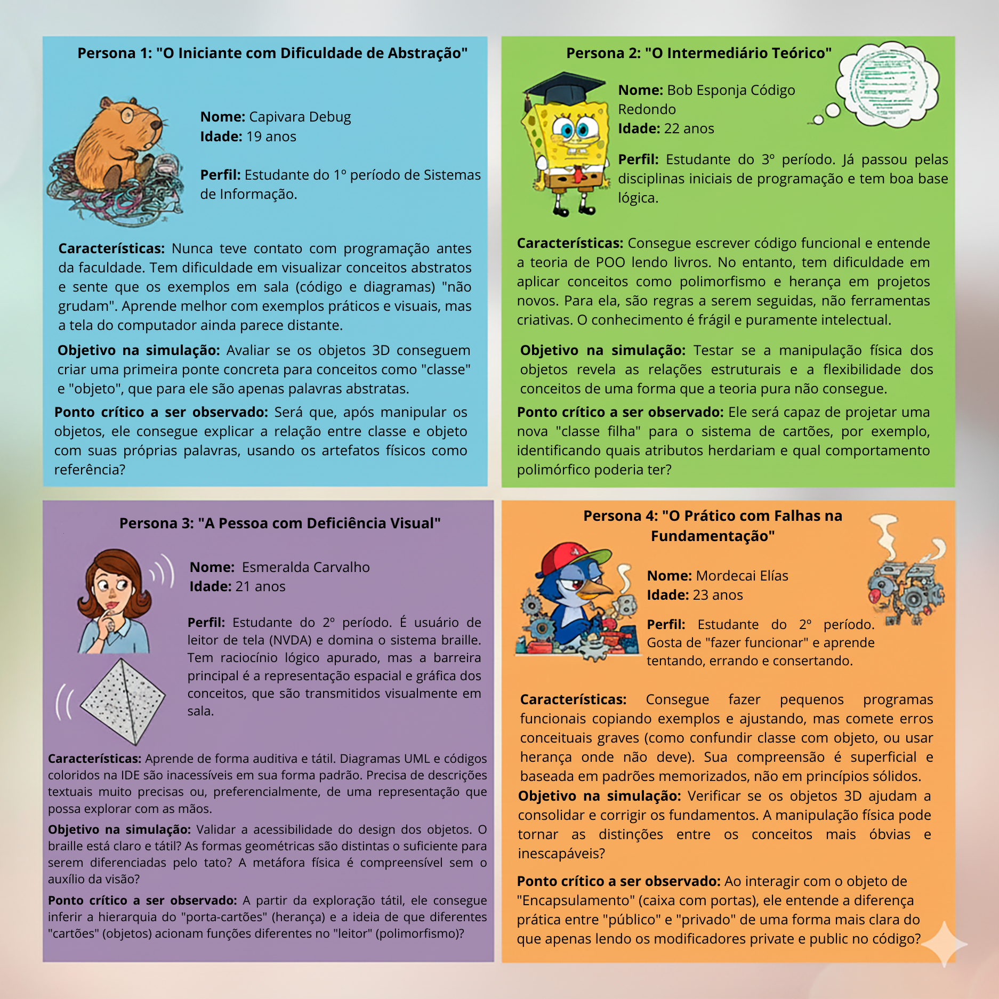

# Using 3D Printing as a Tool to Support Teaching Object-Oriented Programming

Este repositório reúne os materiais, descrições, testes e resultados do Trabalho de Conclusão de Curso intitulado **“Using 3D printing as a tool to support teaching object-oriented programming”**.

O projeto investiga o uso de **objetos físicos impressos em 3D** como recurso didático para apoiar o ensino de **Programação Orientada a Objetos (POO)**, especialmente em contextos onde a abstração representa uma dificuldade para os estudantes.

---

## 🎯 Objetivo do Projeto

O objetivo principal é **avaliar como artefatos físicos podem auxiliar na compreensão de conceitos fundamentais da POO**, tais como:

- Abstração  
- Encapsulamento  
- Arrays e tipagem  
- Herança e polimorfismo  

A proposta busca tornar conceitos abstratos mais acessíveis por meio da **interação tátil, visual e exploratória**, atendendo diferentes perfis de aprendizagem.

---

## 🧠 Conceitos de POO Representados

Os seguintes conceitos foram abordados por meio de objetos físicos impressos em 3D:

| Conceito                    | Objeto Físico Utilizado |
|----------------------------|-------------------------|
| Abstração                  | Labirinto com esfera    |
| Encapsulamento             | Caixa com portas        |
| Arrays e Tipagem           | Caixa compartimentada   |
| Herança e Polimorfismo     | Porta-cartões           |

Cada objeto foi projetado para representar o conceito de forma intuitiva, permitindo aprendizado por **manipulação direta** e **tentativa e erro**.

---

## 🧪 Metodologia

O estudo foi conduzido por meio de uma abordagem **qualitativa e experimental**, utilizando:

- Personas representativas de diferentes perfis de estudantes  
- Sessões de manipulação física dos objetos  
- Observação de comportamentos, dificuldades e insights  
- Registro das respostas dos participantes simulados  

### 📌 Fluxo Metodológico

A imagem abaixo ilustra o processo metodológico adotado no desenvolvimento do estudo:

## 👥 Personas Utilizadas no Estudo

Foram definidas quatro personas para simular diferentes perfis de aprendizagem:

## 🧪 Testes e Avaliações

Cada persona realizou **varios testes**, testes foram realizados para cada conceito de POO representado pelos objetos físicos:

- Teste de Abstração  
- Teste de Encapsulamento  
- Teste de Arrays  
- Teste de Herança e Polimorfismo  

As respostas completas das avaliações estão organizadas por persona e permitem analisar:

- Dificuldades iniciais  
- Momentos de insight  
- Efetividade de cada objeto  
- Limitações e sugestões de melhoria  

📁 As respostas e prompts de avaliação podem ser encontradas nas pastas correspondentes do repositório.

## 🎥 Vídeo Demonstrativo dos Objetos

O vídeo abaixo apresenta o **funcionamento dos objetos físicos**, demonstrando como cada peça representa os conceitos de POO e como ocorre a interação durante os testes.

👉 **Link do vídeo no YouTube:**  
[https://youtu.be/DMreDdifG14]

## 🛠️ Tecnologias e Ferramentas Utilizadas

- Impressão 3D

- Modelagem de objetos físicos educacionais

- Programação Orientada a Objetos (POO)

- Git e GitHub

- LaTeX (artigo científico)

## 📌 Considerações Finais

Os resultados indicam que o uso de objetos físicos impressos em 3D contribui significativamente para a compreensão de conceitos de POO, especialmente para:

Estudantes iniciantes

Aprendizes práticos

Pessoas com deficiência visual (quando há recursos táteis adequados)

O projeto demonstra o potencial da aprendizagem concreta como estratégia complementar ao ensino tradicional de programação.

## 👤 Autor

Brendo Gomes Prates
Trabalho de Conclusão de Curso — Ciência da Computação
